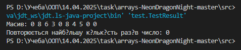

# Практична робота "Масиви, вирази, керування виконанням програми"

## Завдання. 

Знайти в масиві число, яке повторюється найбільшу кількість разів

``` java
package domain;

import java.util.HashMap;
import java.util.Map;

public class Exercise {
    public static int Calculate(int[] array){

        // Підрахунок кількості кожного числа
        Map<Integer, Integer> frequencyMap = new HashMap<>();
        for (int num : array) {
            frequencyMap.put(num, frequencyMap.getOrDefault(num, 0) + 1);
        }

        // Пошук числа з максимальною кількістю повторень
        int mostFrequent = array[0];
        int maxCount = 0;
        for (Map.Entry<Integer, Integer> entry : frequencyMap.entrySet()) {
            if (entry.getValue() > maxCount) {
                mostFrequent = entry.getKey();
                maxCount = entry.getValue();
            }
        }

        return (int) (mostFrequent);
    }
}
```

## Перевірка працездатності створеного класу
``` java
package test;

import java.util.Random;

import domain.Exercise;

public class TestResult {

    public static void main(String[] args) {

        int[] array = new int[10];
        Random random = new Random();

        // Генерація масиву з випадкових чисел від 0 до 9
        for (int i = 0; i < array.length; i++) {
            array[i] = random.nextInt(10);
        }

        // Вивід масиву
        System.out.print("Масив: ");
        for (int num : array) {
            System.out.print(num + " ");
        }
        System.out.println();

        System.out.println("Повторюється найбільшу кількість разів число: " + Exercise.Calculate(array));
    }
}
```

